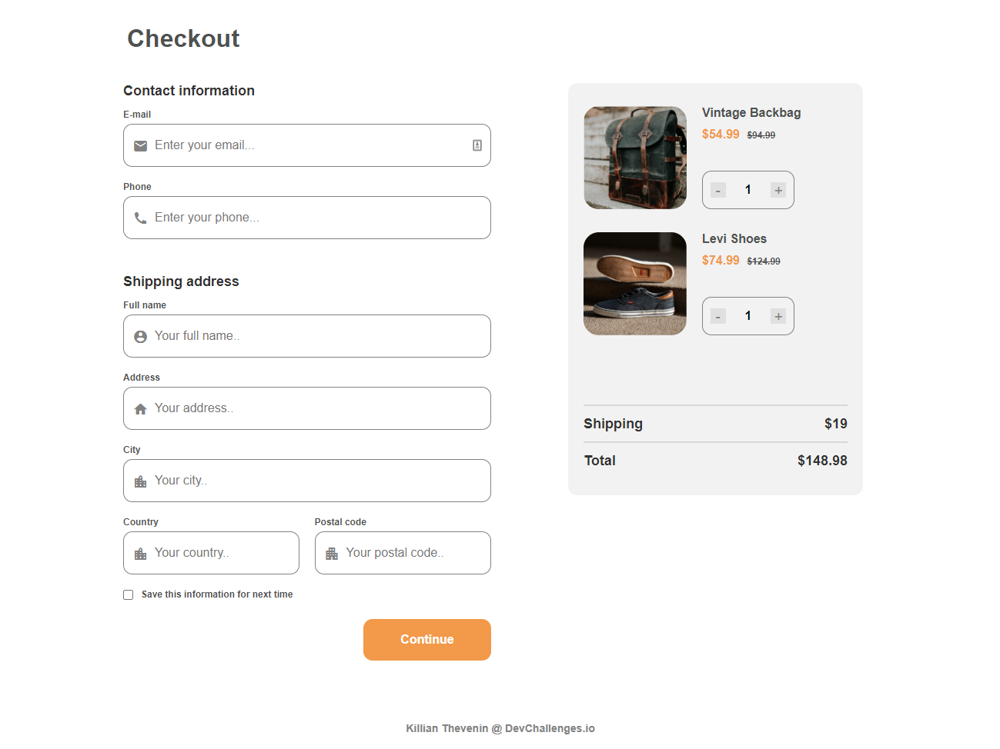

<!-- Please update value in the {}  -->

<h1 align="center">Checkout Page</h1>

<div align="center">
   Solution for a challenge from  <a href="http://devchallenges.io" target="_blank">Devchallenges.io</a>.
</div>

<div align="center">
  <h3>
    <a href="https://challenges-killian.vercel.app/Checkout/index.html">
      Demo
    </a>
    <span> | </span>
    <a href="https://{your-url-to-the-solution}">
      Solution
    </a>
    <span> | </span>
    <a href="https://devchallenges.io/challenges/0J1NxxGhOUYVqihwegfO">
      Challenge
    </a>
  </h3>
</div>

<!-- TABLE OF CONTENTS -->

## Table of Contents

- [Table of Contents](#table-of-contents)
- [Overview](#overview)
  - [Built With](#built-with)
- [Features](#features)
- [How To Use](#how-to-use)
- [Contact](#contact)

<!-- OVERVIEW -->

## Overview

<div align='center'>
  
</div>

I tried this challenge to see what it could be like. First impression: it's really interesting :) I'll probably do more.

### Built With

- [Compile Hero](https://github.com/Wscats/compile-hero)

## Features

<!-- List the features of your application or follow the template. Don't share the figma file here :) -->

This site was created in response to a [DevChallenges] challenge (https://devchallenges.io/challenges). The [challenge] (https://devchallenges.io/challenges/0J1NxxGhOUYVqihwegfO) was to integrate a form for sending purchase.
You had to follow the given design, add the correct inputs and display a message if the form was incomplete and complete.
We didn't have to use javascript but seeing that I use it, I made the number of articles work with the price and the total

## How To Use

To clone and run this application, you'll need [Git](https://git-scm.com).

```bash
# Clone this repository
$ git clone https://github.com/your-user-name/your-project-name
```

Then open the index.html file with your local server. Example: [live serve](https://marketplace.visualstudio.com/items?itemName=ritwickdey.LiveServer) with VScode

## Contact

- Website [killian-thevenin](https://killian-thevenin.netlify.app)
- GitHub [@TheveninKillian](https://github.com/TheveninKillian)
- Twitter [@Killian_Thvn](https://twitter.com/Killian_Thvn)
