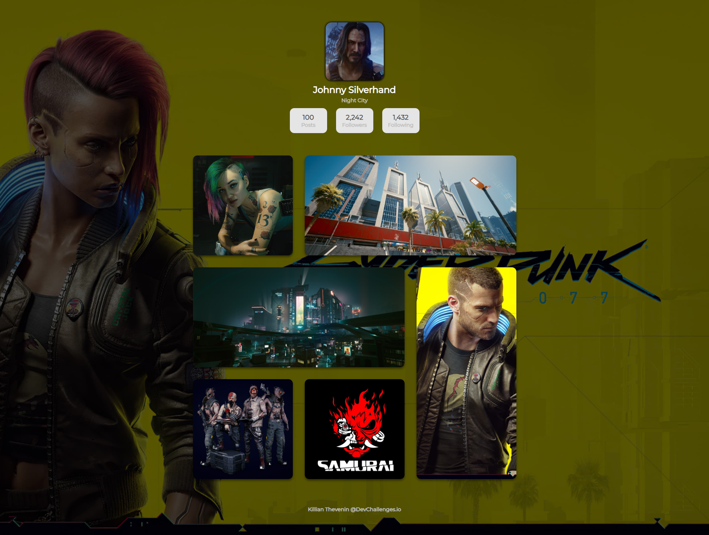

<h1 align="center">My Gallery</h1>

<div align="center">
   Solution for a challenge from  <a href="http://devchallenges.io" target="_blank">Devchallenges.io</a>.
</div>

<div align="center">
  <h3>
    <a href="https://challenges-killian.vercel.app/Gallery/index.html">
      Demo
    </a>
    <span> | </span>
    <a href="https://{your-url-to-the-solution}">
      Solution
    </a>
    <span> | </span>
    <a href="https://devchallenges.io/challenges/gcbWLxG6wdennelX7b8I">
      Challenge
    </a>
  </h3>
</div>

## Table of Contents

- [Table of Contents](#table-of-contents)
- [Overview](#overview)
  - [Built With](#built-with)
- [Features](#features)
- [How To Use](#how-to-use)
- [Contact](#contact)
  
## Overview

<div align='center'>
  
</div>

### Built With

- [Compile Hero](https://github.com/Wscats/compile-hero)

## Features

This application/site was created as a submission to a [DevChallenges](https://devchallenges.io/challenges) challenge. The [challenge](https://devchallenges.io/challenges/gcbWLxG6wdennelX7b8I) was to build an application to complete the given user stories.


## How To Use

To clone and run this application, you'll need [Git](https://git-scm.com).

```bash
# Clone this repository
$ git clone https://github.com/your-user-name/your-project-name
```

Then open the index.html file with your local server. Example: [live serve](https://marketplace.visualstudio.com/items?itemName=ritwickdey.LiveServer) with VScode

## Contact

- Website [killian-thevenin.netlify.app](https://killian-thevenin.netlify.app/)
- GitHub [@TheveninKillian](https://github.com/TheveninKillian)
- Twitter [@Killian_Thvn](https://twitter.com/Killian_Thvn)
