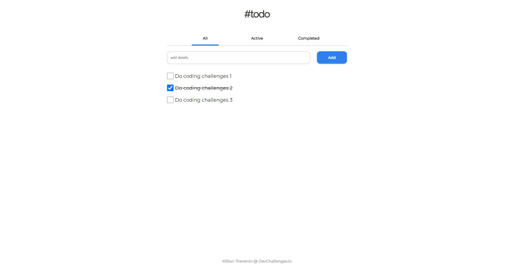

<!-- Please update value in the {}  -->

<h1 align="center">Todo app</h1>

   Solution for a challenge from  <a href="http://devchallenges.io" target="_blank">Devchallenges.io</a>.

  <h3>
    <a href="https://{your-demo-link.your-domain}">
      Demo
    </a>
     | 
    <a href="https://{your-url-to-the-solution}">
      Solution
    </a>
     | 
    <a href="https://devchallenges.io/challenges/hH6PbOHBdPm6otzw2De5">
      Challenge
    </a>
  </h3>

<!-- OVERVIEW -->

## Overview

  

### Built With

<!-- This section should list any major frameworks that you built your project using. Here are a few examples.-->

- [Vue.js](https://vuejs.org/)

## Features

This application/site was created as a submission to a [DevChallenges](https://devchallenges.io/challenges) challenge. The [challenge](https://devchallenges.io/challenges/hH6PbOHBdPm6otzw2De5) was to build an application to complete the given user stories.

## Contact

- Website [Killian-thevenin.netlify.app](https://killian-thevenin.netlify.app/)
- GitHub [@TheveninKillian](https://github.com/TheveninKillian)
- Twitter [@Killian_Thvn](https://twitter.com/Killian_Thvn)
